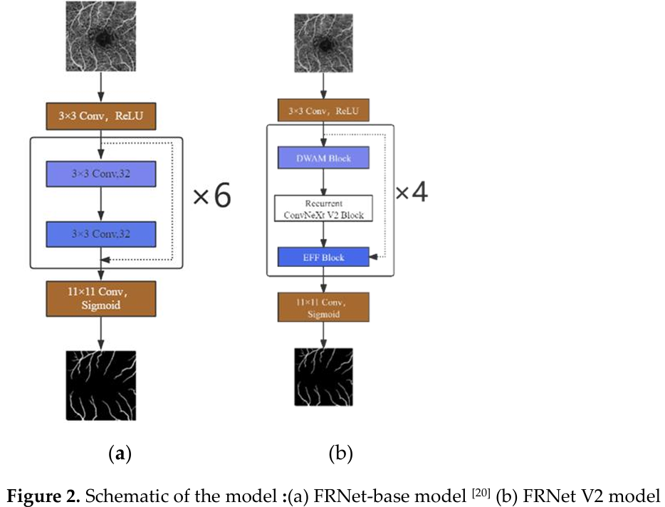

## Citation
```
@article{gaoFRNetV2Lightweight2025,
  title = {{{FRNet V2}}: {{A Lightweight Full-Resolution Convolutional Neural Network}} for {{OCTA Vessel Segmentation}}},
  shorttitle = {{{FRNet V2}}},
  author = {Gao, Dongxu and Wang, Liang and Fang, Youtong and Jiang, Du and Zheng, Yalin},
  date = {2025-03-27},
  journaltitle = {Biomimetics},
  shortjournal = {Biomimetics},
  volume = {10},
  number = {4},
  pages = {207},
  issn = {2313-7673},
  doi = {10.3390/biomimetics10040207},
  url = {https://www.mdpi.com/2313-7673/10/4/207},
}
```

## FRNet V2

FRNet V2 combines the ConvNeXt V2 architecture with deep separable convolution and introduces a recursive mechanism.

<figure class="half">
    
</figure>


## Run
```
git clone https://github.com/wangliang612/OCTA-FRNet--V2
cd OCTA-FRNet V2
pip install -r requirements.txt
python run_benchmark.py
```
The current version of the code contains 2 models: `FRNet-base` and `FRNet`, and 3 datasets: `ROSSA`, `OCTA_500 (3M)` and `OCTA_500 (6M)`.

By running `run_benchmark.py`, the 2 models on 3 datasets will be trained and evaluated at once (that is, a total of 2x3=6 results).

The results will be saved in `json` format to the `result` folder.

## The ROSSA Dataset
ROSSA is an retinal OCTA vessel segmentation dataset semi-automatically annotations created by us using Segmentation Anything Model(SAM). It contains 918 images, which are stored in the `dataset/ROSSA` folder of this repo:

`train_manual` contains 100 images (NO.1-NO.100) that we manually annotated, using as training set.

`train_sam` contains 618 images (NO.301-NO.918) that are semi-automatically annotated using SAM, also using as training set.

`val` contains 100 images (NO.101-NO.200) that we manually annotated, , using as validation set.

`test` contains 100 images (NO.201-NO.300) that we manually annotated, , using as test set.

## Configure Datasets
If you want to run your own dataset, you can configure it in `datasets.py`, in function `prepareDatasets`:
```
def prepareDatasets():
    all_datasets = {}
    
    // Add your datasets here
    // ......

    return all_datasets
```
Note that your dataset should follow the given structure:
```
--dataset
    |
    |--Your Dataset
        |
        |--train
        |--val
        |--test
```
where each folder in `train`, `val`, `test` should follow the given format:( take `train` as an example)
```
--train
    |
    |--image
    |    |
    |    |--......(images)
    |    |--......
    |    |.......
    |--label
        |
        |--......(labels)
        |--......
        |......
```
## Configure Models
If you want to run your own model, please modify the `models` variable in `settings_benchmark.py`:
```
models = {
    # More models can be added here......
}
```
Each item in `models` must be of type `ObjectCreator`, in which your model can be created.


## Thanks
The OCTA-500 Dataset: [IPN-V2 and OCTA-500: Methodology and Dataset for Retinal Image Segmentation](https://www.semanticscholar.org/paper/IPN-V2-and-OCTA-500%3A-Methodology-and-Dataset-for-Li-Zhang/3dfd924ad26e737db805ed29af61cc827e876bd9)

Segmentation Anything Model (SAM): https://github.com/facebookresearch/segment-anything

The main code mainly based on: https://github.com/nhjydywd/OCTA-FRNet/tree/main
